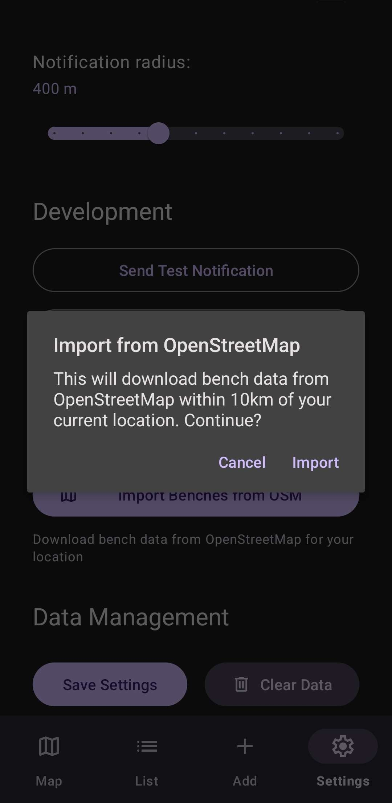
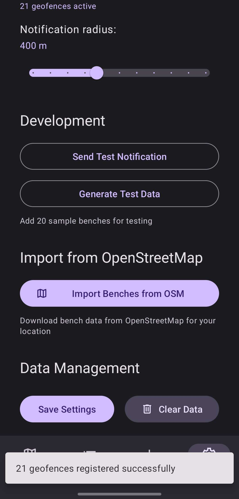
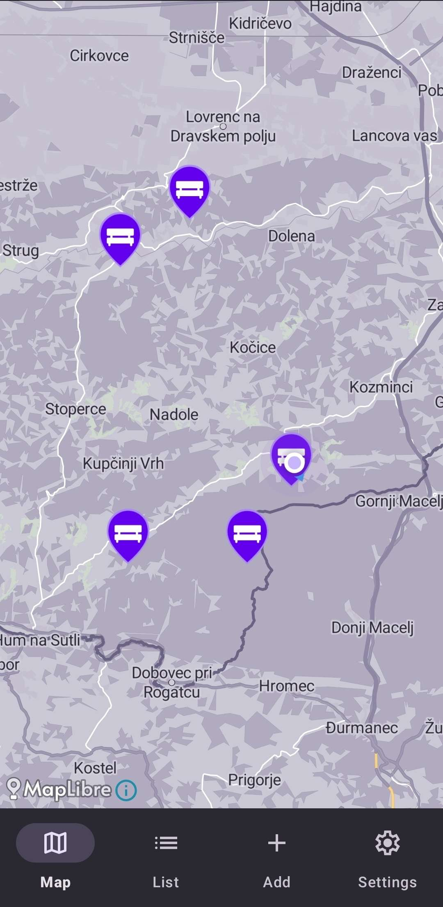

# Moshi - JSON knjižnica za Kotlin in Android

## Opis

**Moshi** je JSON knjižnica za Android, Java in Kotlin, ki jo je razvilo podjetje Square. Omogoča pretvorbo med JSON podatki in Kotlin/Java razredi z podporo za Kotlin-specifične funkcionalnosti kot so non-nullable tipi in privzete vrednosti parametrov.

Za drugo nalogo pri PORA sem Moshi izbral zaradi potrebe parsing JSON odgovorov iz Overpass API, ki vrača podatke o klopeh iz OpenStreetMap baze. Moshi omogoča type-safe in pretvorbo JSON struktur v Kotlin data class objekte.

### Prednosti

- **Kotlin-first pristop:** Podpora za Kotlin funkcionalnosti (null-safety, default parametri, data classes)
- **Type-safe:** Tipizacija s compile-time preverjanjem (pri uporabi codegen)
- **Zmogljivost:** Codegen generira optimizirane adapterje brez reflection overhead-a
- **Manjša velikost:** Manjša kot Gson, posebej ko uporabljamo codegen namesto reflection
- **Prilagodljivost:** Enostavno sestavljanje in prilagajanje adapterjev
- **Debugging:** Izjeme s podrobnimi informacijami o lokaciji napake v JSON strukturi
- **Integracija z OkHttp/Retrofit:** Odlično deluje z drugimi Square knjižnicami
- **Aktivno vzdrževanje:** Podjetje Square redno posodablja knjižnico

### Slabosti

- **Manj zrela kot Gson:** Mogoče težje najti odgovore na probleme
- **Strožja kot Gson:** Ne dovoljuje serializacije platform tipov (java.*, android.*) brez custom adapterjev
- **Potrebna dodatna konfiguracija:** Za codegen je potrebno nastaviti KSP/KAPT
- **Manj konfiguracijskih možnosti:** Nima field naming strategij, versioning policy, itd.
- **Ni JsonElement modela:** Uporablja Map/List namesto vmesnega drevesa (kot Gson JsonElement)

### Licenca

Moshi je na voljo pod [**Apache License 2.0**](https://github.com/square/moshi/blob/master/LICENSE.txt), ki omogoča:
- Prosto uporabo za osebne, izobraževalne in komercialne namene
- Spreminjanje in prilagajanje kode
- Distribucijo programske opreme ob upoštevanju pogojev licence
- Patentno zaščito uporabnikov

### Število uporabnikov

- **GitHub stars:** 10.1k+
- **Ocena uporabe:** 100,000+ Android aplikacij
- Uporabljajo ga večja podjetja: **Square, Uber, Lyft, Airbnb** in druge
- Del ekosistema Square knjižnic (Retrofit, OkHttp, LeakCanary)

### Časovna in prostorska zahtevnost

#### Codegen način (priporočeno):
- **Serializacija (toJson):** O(n), kjer je n število polj v objektu
  - Direkten dostop do polj brez reflection
  - Minimalen overhead
- **Deserializacija (fromJson):** O(n), kjer je n število polj v JSON
  - Streaming parsing - procesira token za tokenom
  - Konstantna poraba pomnilnika ne glede na velikost JSON
- **Prostorska zahtevnost:** O(n)
  - Generiran adapter: majhna količina kode (~100-200 bytes na class)
  - Runtime: samo trenutni objekt + parsing buffer
  - Brez reflection metadata v pomnilniku

#### Reflection način (KotlinJsonAdapterFactory):
- **Serializacija:** O(n) + reflection overhead
- **Deserializacija:** O(n) + reflection overhead
- **Prostorska zahtevnost:** O(n) + kotlin-reflect knjižnica
  - Dodatni pomnilnik za reflection metadata
  - Caching adapterjev zmanjša overhead pri ponovni uporabi

### Vzdrževanje

- **Razvijalec:** Square, Inc.
- **Zadnja sprememba:** Aktivno(zadnji commit pred 2 dnevi)
- **Trenutna različica:** 1.15.2 (december 2024)
- **Release cikel:** enkrat do dvakrat na leto
- **Long-term podpora:** Zelo verjetna, del Square ekosistema


---

## Demo aplikacija

[PLACEHOLDER - DEMO BO TUKAJ]

---

## Uporaba v drugi PORA aplikaciji

Pri aplikaciji BenchFinder sem Moshi uporabil za **parsing JSON odgovorov iz Overpass API**, ki vrača podatke o klopeh iz OpenStreetMap baze podatkov. Overpass API vrača JSON strukture z gnezdenimi objekti in seznami.

### 1. Dodajanje dependency

V `build.gradle.kts` sem dodal Moshi z codegen podporo:

```kotlin
dependencies {
    val moshi_version = "1.15.2"
    implementation("com.squareup.moshi:moshi:$moshi_version")
    implementation("com.squareup.moshi:moshi-kotlin:$moshi_version")
    ksp("com.squareup.moshi:moshi-kotlin-codegen:$moshi_version")
    
    // Za Retrofit integracijo
    implementation("com.squareup.retrofit2:converter-moshi:3.0.0")
}
```

### 2. Modeliranje Overpass JSON odgovora

Overpass API vrača JSON v naslednji obliki:

```json
{
  "version": 0.6,
  "generator": "Overpass API",
  "osm3s": {
    "timestamp_osm_base": "2026-01-03T17:13:19Z",
    "copyright": "The data included in this document is from www.openstreetmap.org. The data is made available under ODbL"
  },
  "elements": [
    {
      "type": "node",
      "id": 4713243791,
      "lat": 46.5621171,
      "lon": 15.6494756,
      "tags": {
        "amenity": "bench",
        "backrest": "yes",
        "material": "wood",
        "seats": "3"
      }
    }
  ]
}
```

S pomočjo Moshi codegen sem ustvaril type-safe data class modele:

```kotlin
@JsonClass(generateAdapter = true)
data class OverpassResponse(
    val version: Double,
    val generator: String,
    val osm3s: Osm3s,
    val elements: List<OverpassElement>
)

@JsonClass(generateAdapter = true)
data class Osm3s(
    @Json(name = "timestamp_osm_base")  // Mapiranje snake_case -> camelCase
    val timestampOsmBase: String,
    val copyright: String
)

@JsonClass(generateAdapter = true)
data class OverpassElement(
    val type: String,
    val id: Long,
    val lat: Double?,
    val lon: Double?,
    val tags: Map<String, String>?
)
```

**Moshi funkcionalnosti v uporabi:**
- `@JsonClass(generateAdapter = true)` - Codegen za optimalno zmogljivost
- `@Json(name = ...)` - Mapiranje različnih imen polj (snake_case ↔ camelCase)
- Nullable tipi - Kotlin null-safety pri neobveznih poljih
- `Map<String, String>` - Dinamični podatki brez vnaprej znane strukture

### 3. Pretvorba v domenski model

Ustvaril sem extension funkcijo za pretvorbo Overpass elementov v moj `Bench` data class:

```kotlin
fun OverpassElement.toBench(): Bench? {
    // Filtriranje - samo nodes z koordinatami
    if (type != "node" || lat == null || lon == null) return null
    
    val tags = this.tags ?: return null
    if (tags["amenity"] != "bench") return null
    
    // Type-safe pretvorba s privzetimi vrednostmi
    return Bench(
        latitude = lat,
        longitude = lon,
        backrest = tags["backrest"]?.equals("yes", ignoreCase = true) ?: false,
        material = tags["material"],
        seats = tags["seats"]?.toIntOrNull(),
        wheelchair = tags["wheelchair"]?.equals("yes", ignoreCase = true) ?: false,
        notes = buildNotes(tags),
        isFavorite = false
    )
}

private fun buildNotes(tags: Map<String, String>): String? {
    val notesList = mutableListOf<String>()
    tags["colour"]?.let { notesList.add("Color: $it") }
    tags["direction"]?.let { notesList.add("Faces: $it") }
    tags["covered"]?.let { if (it == "yes") notesList.add("Covered") }
    return if (notesList.isNotEmpty()) notesList.joinToString(", ") else null
}
```

### 4. Uporaba z Retrofit in OkHttp

V `OverpassService` sem Moshi integriral s klicem na Overpass API:

```kotlin
class OverpassService {
    private val client = OkHttpClient()
    
    // Inicializacija Moshi z Kotlin reflection factory
    private val moshi = Moshi.Builder()
        .add(KotlinJsonAdapterFactory())  // Podpora za Kotlin tipy
        .build()
    
    // Ustvarjanje type-safe adapterja
    private val adapter = moshi.adapter(OverpassResponse::class.java)
    
    suspend fun fetchBenchesInRadius(
        latitude: Double,
        longitude: Double,
        radiusMeters: Int = 10000
    ): Result<List<Bench>> = withContext(Dispatchers.IO) {
        try {
            val response = client.newCall(request).execute()
            val body = response.body?.string() 
                ?: return@withContext Result.failure(IOException("Empty response"))
            
            // JSON → OverpassResponse (Moshi parsing)
            val overpassResponse = adapter.fromJson(body)
                ?: return@withContext Result.failure(IOException("Failed to parse JSON"))
            
            // OverpassResponse → List<Bench> (domenski model)
            val benches = overpassResponse.elements.mapNotNull { it.toBench() }
            
            Result.success(benches)
        } catch (e: Exception) {
            Result.failure(e)
        }
    }
}
```

### 5. Obravnava napak

Moshi ponuja error messages za lažje debuggiranje:

```kotlin
try {
    val overpassResponse = adapter.fromJson(body)
} catch (e: JsonDataException) {
    // Primer napake: "Expected a double but was NULL at path $.elements[3].lat"
    Log.e("OverpassService", "JSON parsing error: ${e.message}")
    // Moshi točno pove, kje v JSON strukturi je prišlo do napake
} catch (e: IOException) {
    Log.e("OverpassService", "Network error: ${e.message}")
}
```


### Zaslonski posnetki uporabe

<table>
  <tr>
    <th>Uvoz klopi iz OSM</th>
    <th>Uspešen import</th>
    <th>Klopi na zemljevidu</th>
  </tr>
  <tr>
    <td></td>
    <td></td>
    <td></td>
  </tr>
</table>
